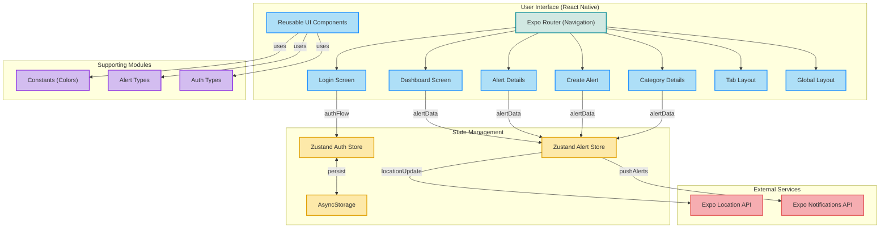

```mermaid
graph TD
    %% User Interface Layer
    subgraph "User Interface (React Native)"
        A["Login Screen"]:::ui
        B1["Dashboard Screen"]:::ui
        B2["Alert Details"]:::ui
        B3["Create Alert"]:::ui
        B4["Category Details"]:::ui
        C["Tab Layout"]:::ui
        D["Global Layout"]:::ui
        E["Reusable UI Components"]:::ui
        F["Expo Router (Navigation)"]:::router
    end

    %% State Management Layer
    subgraph "State Management"
        S1["Zustand Auth Store"]:::state
        S2["Zustand Alert Store"]:::state
        S3["AsyncStorage"]:::state
    end

    %% External Services Layer
    subgraph "External Services"
        X1["Expo Location API"]:::external
        X2["Expo Notifications API"]:::external
    end

    %% Supporting Modules Layer
    subgraph "Supporting Modules"
        M1["Constants (Colors)"]:::support
        M2a["Alert Types"]:::support
        M2b["Auth Types"]:::support
    end

    %% Connections from Routing to UI screens
    F --> A
    F --> B1
    F --> B2
    F --> B3
    F --> B4
    F --> C
    F --> D

    %% UI interactions with State Management
    A -->|"authFlow"| S1
    B1 -->|"alertData"| S2
    B2 -->|"alertData"| S2
    B3 -->|"alertData"| S2
    B4 -->|"alertData"| S2

    %% State persistence and external interactions
    S1 <-->|"persist"| S3
    S2 -->|"pushAlerts"| X2
    S2 -->|"locationUpdate"| X1

    %% Reusable UI Components dependencies
    E -->|"uses"| M1
    E -->|"uses"| M2a
    E -->|"uses"| M2b

    %% Click Events
    click A "https://github.com/fbrusatti/applert/blob/master/app/(auth)/login.tsx"
    click B1 "https://github.com/fbrusatti/applert/blob/master/app/(app)/dashboard.tsx"
    click B2 "https://github.com/fbrusatti/applert/blob/master/app/(app)/alert/[id].tsx"
    click B3 "https://github.com/fbrusatti/applert/blob/master/app/(app)/create-alert.tsx"
    click B4 "https://github.com/fbrusatti/applert/blob/master/app/(app)/category/[id].tsx"
    click C "https://github.com/fbrusatti/applert/blob/master/app/(tabs)/_layout.tsx"
    click D "https://github.com/fbrusatti/applert/blob/master/app/_layout.tsx"
    click E "https://github.com/fbrusatti/applert/tree/master/components"
    click S1 "https://github.com/fbrusatti/applert/blob/master/store/auth-store.ts"
    click S2 "https://github.com/fbrusatti/applert/blob/master/store/alert-store.ts"
    click M1 "https://github.com/fbrusatti/applert/blob/master/constants/colors.ts"
    click M2a "https://github.com/fbrusatti/applert/blob/master/types/alert.ts"
    click M2b "https://github.com/fbrusatti/applert/blob/master/types/auth.ts"

    %% Styles
    classDef ui fill:#AEDFF7,stroke:#1E90FF,stroke-width:2px;
    classDef router fill:#D1E8E2,stroke:#14919b,stroke-width:2px;
    classDef state fill:#FDE9A9,stroke:#E0A106,stroke-width:2px;
    classDef external fill:#F6ADB1,stroke:#E25856,stroke-width:2px;
    classDef support fill:#D3BDF0,stroke:#8A2BE2,stroke-width:2px;
```